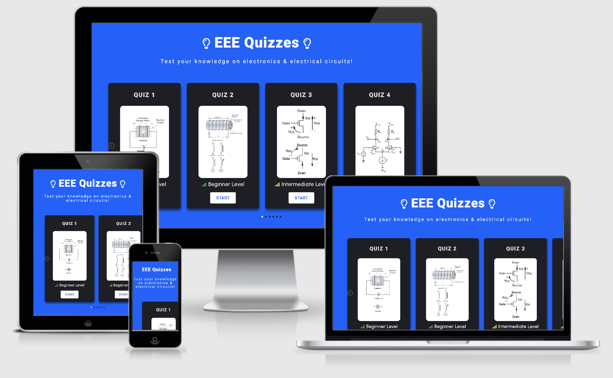
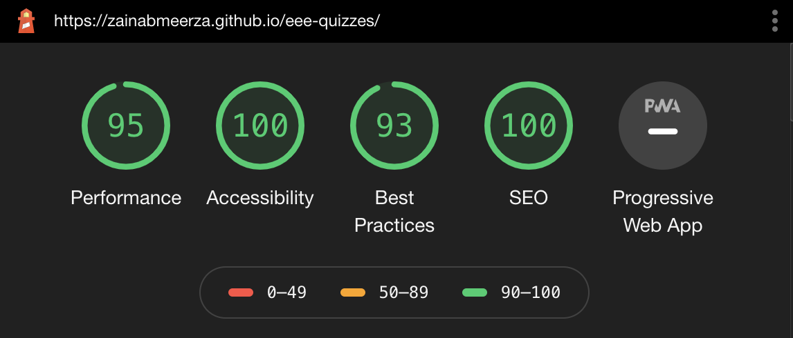
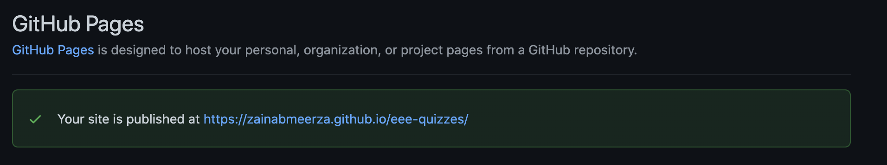

<h1><strong>EEE Quizzes</strong></h1>

<h2>Code Institute Milestone Project 2</h2>

    The aim of the second project is to develop a static front-end website with at least three individual pages using HTML and CSS. The website is designed such that it follows industry standard UX conventions. This website is made for educational purposes only. 

<a href="https://zainabmeerza.github.io/istanbul-travel/" target="_blank" >View the live website in GitHub Pages</a>

This image is produced using the tool from <a href="http://ami.responsivedesign.is/#" target="_blank">Am I Responsive</a>

This website is created to provide guidance and help for tourists that are interested in visiting Istanbul, Turkey. It equips them with
all the necessary information in order to encourage and guide them to plan a trip to the city. Information such as attraction spots, accomadation suggestions, restraunts to dine in as well as keeping them updated with the latest events that may be taking place during their visit. 

The website is divided into the following sections listed below:
    <ol>
        <li>Home page - to provide the user and introduction and overview of what the webiste is about.</li>
        <li>Attractions page - to provide a list of the top sightseeing spots that travellers should visit.</li>
        <li>Lodging page - to compile together the best accomadation spots such as hotels, hostels, bed&breakfats, and resorts that they can stay in (with linked reviews from previous customers).</li>
        <li>Dining page - to provide them with a list of the finest restraunts, cafes and bakeries (with linked reviews from previous customers)</li>
        <li>Gallery page - to display a variety of pictures of the city and it's culture.</li>
        <li>Form page - for the user to sign up to subscribe to a newsletter </li>
    </ol>

<h3><strong>The business goals of this website are the following:</strong></h3>
    <ul>
        <li>To allow hotels and resorts to advertise and promoting their accomadtion services. </li>
        <li>To allow local Turkish businesses to promote their goods and products to tourists.</li>
        <li>To allow restraunts and other hospitality services to advertise their services to potential visitors.</li>
        <li>To provide a platform for freelancing photographers to share their photos of Istanbul in order to gain exposure.</li>
        <li>To promote festivals, tours, concerts and shows that may be upcoming in Istanbul.</li>
    </ul>

<h3><strong>The customer goals of this website are the following:</strong></h3>
 <ul>
        <li>Search for a reliable and updated source which provide users with trustworthy recommendations on places to visit.</li>
        <li>Be inspired, encouraged and excited to plan a trip to Istanbul.</li>
        <li>To find out more information on the city of Istanbul, and the variety of activites that are available to do there. </li>
        <li>To be able to sign up to recieve upcoming events, offers, and latest news via a newsletter.</li>
        <li>To find a selection of trustworthy recommendations for restraunts, hotels and markets.</li>
</ul>

<h1><strong>UX</strong></h1>

<h2><strong>Strategy</strong></h2>
The strategy approach for this site was to provide reputable trustworthy  content that users would be able to rely on for guidance. Additionally ease of access and simplicity was important to allow users to find the specifc information that they require to help plan their trips. Promoting users to travel to Istanbul and making it on their top list of travel choices was also the aim. 

An essential part is to define who the target users of this website would be,and to consider what features they would like to see.

<strong>The ideal users of this website would be:</strong>
<ul>
<li>People (such as tourists) intertested in visiting Istanbul, Turkey. </li>
<li>Families and groups looking to book a holiday. </li>
<li>Backpacking travellers.</li>
<li>First time travellers to Turkey. </li>
</ul>

<strong>This project will help these users by:</strong>
<ul>
<li>Providing a clear and concise guide that would be easy for them to navigate and focuses on important details.</li>
<li>Showing a selection of beautiful photos that will motivate and encourage travellers to visit, and help promote the city and make it seem as the more desirable choice. </li>
<li>Providing a list of the best sightseeing destinations and a brief background of these places.</li>
<li>Giving the users recommencedation of where to eat and stay during their trip.</li>
<li>Allowing them to subscribe to a newsletter that will keep them updated with the latest events and email them a downloadable travel guide brochure</li>
</ul>

The information was kept as minimal as possible in order to not overwhelm users, but instead focus more on making it seem more visually appealing. Hence including several forms of media (pop-up modal images, videos, maps, carousels) that they could interact with rather than just lots of text.
 

<strong>User stories:</strong>
<ol>
<li>As a first time visitor to the site, I would like to be able to navigate eaily throughtout the site and find the relevant information I need. </li>
<li>As a first time tourist, I would like some reliable recommendations of where I should visit, which restraunts I should go eat in, and where I can accommodate during my stay that fits in with my budget.</li>
<li>As a returning visitor to the site, I would like to stay updated with the latest events, trips, tours and festivals that are possibly taking place during the time of my visit to Istanbul.</li>
<li>As a first time traveller to Istanbul, I would like to know some background information as to what I should expect from this city and what it is popular and known for. </li>
<li>As a business owner, I would potentially be interested in advertising and promoting my service (restraunt, hotel or product etc.) onto the site to potenial customers(tourists) who may visit. </li>
<li>As a freelancing photographer, I would potentially like to feature my photographs of Istanbul to promote my work and gain exposure. </li>
</ol>

<h2><strong>Scope</strong></h2>
To achieve the desired user & business goals, the following features have been included in this project release:
<ul>
<li>A header containing the logo, title and menu bar to easily navigate across the pages.</li>
<li>A home page which introduces the user to what the website is about.</li>
<li>Videos that will provide the user with more insight as to what to expect from Istanbul in terms of views, landscapes and culture.</li>
<li>An interacive map of the city which will highlight the famous places to visit</li>
<li>A link to a simple subscription form that will update users with the upcoming events through email and a downloadable trave guide brochure.</li>
<li>Ratings and recommendations of places to eat and stay in.</li>
<li>A gallery of images that will present users with appealing visuals that would further enourage them to plan their trip.</li>
<li>A footer containing quick links to the pages of the site, and to the social media links.</li>
</ul>

<h2><strong>Structure</strong></h2>
This website is made up of 6 pages in total (however only 4 have been completed with content. It includes a responsive navigation bar at the top that allows users to easily navigate across their section of interest. The flow of the website is in the following order; Home to introduce the users to the purpose of the site, next, attractions to sight see that cannot be passed, then places to stay in, restraunts to eat in, and finally ends it off with a gallery of images and a subsription form for users who are interseted in future events.

<h2><strong>Skeleton</strong></h2>

The website consits of six pages, but only four out of six were managed to be completed. The completed pages are; Home (introduces the user into the purpose of the website), Attractions (lists the top must sight-seeing locations that the user should visit), Gallery (displays a variety of images to provide the user with some insight as to what they should expect from the city), and Form (which includes a newsletter subscription form).

<h3>The wireframe mockups for each page:</h3>
<a href="https://github.com/zainabmeerza/istanbul-travel/blob/main/assets/images/wireframes/Home%20Page%20-%20Desktop.png" target="_blank" >Home - Desktop View</a> 
 
<a href="https://github.com/zainabmeerza/istanbul-travel/blob/main/assets/images/wireframes/Home%20Page%20-%20Mobile.png" target="_blank" >Home - Mobile View</a> 
 
<a href="https://github.com/zainabmeerza/istanbul-travel/blob/main/assets/images/wireframes/Attractions%20Page%20-%20Desktop.png" target="_blank" >Attraction - Desktop View</a> 
 
<a href="https://github.com/zainabmeerza/istanbul-travel/blob/main/assets/images/wireframes/Attractions%20Page%20-%20Mobile.png" target="_blank" >Attractions - Mobile View</a> 
 
<a href="https://github.com/zainabmeerza/istanbul-travel/blob/main/assets/images/wireframes/Lodging%20and%20Dining%20Page%20-%20Desktop.png" target="_blank" >Lodging & Dining - Desktop View</a> 
 
<a href="https://github.com/zainabmeerza/istanbul-travel/blob/main/assets/images/wireframes/Lodging%20%26%20Dining%20-%20Mobile.png" target="_blank" >Lodging & Dining - Mobile View</a> 
 
<a href="https://github.com/zainabmeerza/istanbul-travel/blob/main/assets/images/wireframes/Gallery%20Page%20-%20Desktop.png" target="_blank" >Gallery - Desktop View</a> 
 
<a href="https://github.com/zainabmeerza/istanbul-travel/blob/main/assets/images/wireframes/Gallery%20Page%20-%20Mobile.png" target="_blank" >Gallery - Mobile View</a> 
 
<a href="https://github.com/zainabmeerza/istanbul-travel/blob/main/assets/images/wireframes/Form%20Page%20-%20Desktop.png" target="_blank" >Form - Desktop View</a> 
 
<a href="https://github.com/zainabmeerza/istanbul-travel/blob/main/assets/images/wireframes/Form%20Page%20-%20Mobile.png" target="_blank" >Form - Mobile View</a> 
 

<h2><strong>Surface</strong></h2>

The Google fonts 'Oswald' and 'Roboto' were used consistently across the entire website. 'Oswald' was used for headings whilst 'Roboto' was used for the body text. 

The color pallete used was generated by an online tool. Encorprating white and red into the colour scheme was important as it matched with the flag of Turkey. Additionally I wanted to add some shade of blue/green as it resonates with the nature of the city; plenty of blue seas and forestry. I paired this with white and a yellow shade to contrast. The colour pallette generated and used is shown below.

To stand out when hovering over links (such as icons for social media and navigation links) the color changes from white to yellow. Additionally, a yellow underline is included in the navigation bar to further indicate to the user what page they are currently on. 
 
 

<h1><strong>Features</strong></h1>
<h2><strong>Header</strong></h2>
The website consists of four completed pages; Home, Attractions and Gallery, Form. It also consists of two uncompleted pages; Lodging and Dining. The header of the wesbite includes a logo and menu bar on the top of every page with a consistnet style. This will allow the user to efficiently move around and access the relevant information they require via the menu. The navigation links remain active when in use and this is indicated by a yellow underline. Additionally this menu bar is responsive across various devices. When being viewed on smaller devices such as mobile phones, the menu is collapsed into a hamburger icon that can be expaned when clicked on. The title in the header is also linked to the home page.
 
 
<h2><strong>Footer</strong></h2>
Every page has a footer which includes a 'visit istanbul' slogan, quick links to the other pages of the site (to avoid scrolling to the top), alternatively there is also an arrow icon at the bottom of the page that is linked to scroll to the top of the page when clicked on. Social media icons are displayed which are linked to the blog's social media accounts.
 
 
<h2><strong>Home</strong></h2>
The Home page starts with a large hero image with a scenic view of the coast in Istanbul. Below this a section on 'Why you should visit' is included. Thiis section only icludes a single quote in order to be kept short and convinving to users at first glance. Underneath this is the main text content of the home page which introduces the user with the purpose of the site. This section is divided into three columns; the first two columns are filled with text, and the column on the right includes an image of a famous bridge. To let the user know more about Istanbul before going further into browsing the website, two youtube videos are linked below this section using an embedded link from Youtube. Including a video is another way of providing the user with information without overwhelming them with too many words but rather showing them instead. Finally, an interactive map section is also included and this is done by using an embedded link from Google Maps. This allows the users to explore places visually on a map rather than just by reading text. 
 
 
<h2><strong>Attractions</strong></h2>
This page consists of the majority of the information on the website. It provides an overview of the most famous spots to visit and the history behind each location. Alongside the text for each location an interative and responsive carousel of images is included to make it more visually appealing to users. The title of this page is an h2 element that sits underneath the responsive menu bar. The content on this page is built using h2 and p elements. The images are set to float to the left, and the paragraphs are set to float to the right.
 
 
<h2><strong>Gallery</strong></h2>
 This page follows the same header and title format as the previous pages to keep the consitency. The main body is made up of a gallery modal pop-up images consiting of 30 pictures retrieved from Unsplash with their respective captions on each photo. This gallery was created using FancyBox libaries that were linked to my HTML code. The gallery is aligned to center the page and is responsive across different devices.
  
  
<h2><strong>Subscribe</strong></h2>
At the bottom of every page, right above the footer a sign up section had been included. This section has the heading 'Sign up to recieve a travel guide brochure' with a 'subscribe' button underneath. This button links to the form page. The form page includes a simple signup form that allows the user to subscribe to a regular newsletter from the travel blog and recieve a downloadable travel guide brochure via email. The form is made up of 2 text inputs for the name, and one email input. They have all been set to required, therefore the form is not completed until all fields have been filled out. The background on this page provides a sceneic image of the city that does not interfere with the styling of the form. This form is also responsive across different devices.
 
 
<h1><strong>Features to Implement in the future:</strong></h1>
Due to limited time I was unable to include content in the lodging and dining pages as I planned to do so. Furthermore, due to my limited skills and scope of knowledge, there are several features and widgets I would hope to also implement in a future release of this project. These inlude:
<ul>
<li>Embedded weather widgets that would let the user know about the current weather conditions in Istanbul.</li>
<li>A lodging section filled with a list of hotels, hostels, resorts, B&B's that can be sorted according to their rating, availability, room type, number of guests, and price range. It will also include images and customer reviews. </li>
<li>A dining section filled with a list of restraunts, cafes, bakeries that can be sorted according to their rating and region. It will also include images and customer reviews. </li>
<li>An FAQ section with commonly asked questions to address some tips and advice to users planning on travelling to Istanbul.</li>
<li>A page advertising the latest and upcoming events in Istanbul such as concerts and festivals. This will include adverts from several business companies.</li>
<li>A page that includes a list of experiences, such as day trips, cruises, ferry rides, museum visits, etc. This will also inlcude ticket information, prices, booking information, and opening times. </li>
<li>A section with pre-planned itentaires that can be downloaded as a PDF file and printed out for users to follow.</li>
<li>The option to chose the language of the site. As this is a travel website, customers from a wide range of backgrounds, cultures and countries are expected to be browsing, and hence being able to tailor the language to their needs can help improve their accessibility.</li>
<li>The option to change currency options when viewing ticket prices or hotel prices.</li>
</ul>

<h1><strong>Technologies Used</strong></h1>
This project is based on HTML and CSS programming languages. Several technologies and tools were used to enable a functional design. These are listed below.
<ul>
<li>The three programming langauges;<strong> HTML5, CSS</strong> and <strong>JavaScript</strong>.</li>
<li><a href="https://www.gitpod.io/" target="_blank">GitPod</a> - Was the development environment used to write the code and build the project. </li>
<li><a href="https://github.com/" target="_blank">GitHub</a> - Was the platform used to hose the code that was written and pushed from GitPod. </li>
<li><a href="https://balsamiq.cloud" target="_blank">Balsamiq</a> - A rapid low-fidelity UI wireframing tool used to sketch a rough plan of the website structure and contents to abiding by rhe best UX practices. </li>
<li><a href="https://fontawesome.com/v6.0/icons?d=gallery&p=1&s=solid" target="_blank">FontAwesome</a> - The social media and title icons were taken from the toolkit provided by FontAwesome.</li>
<li><a href="https://fancyapps.com/docs/ui/fancybox/" target="_blank">FancyBox</a> - Used to create a gallery modal popup to display a slideshow of images. </li>
<li><a href="https://fonts.google.com/specimen/Oswald#pairings" target="_blank">Google Fonts</a> - Used to style the website fonts. </li>
<li><a href="https://developer.chrome.com/docs/devtools/" target="_blank">Chrome Development Tools</a> - Used to test every stage whilst building the website, to help find and fix bugs within the code and test the responsiveness of the pages.</li>
<li><a href="https://www.youtube.com/" target="_blank">Youtube</a> - To provide an embedded link to the videos on the home page.</li>
<li><a href="https://www.google.com/maps/place/%C4%B0stanbul,+Turkey/@41.0039643,28.4517462,9z/data=!3m1!4b1!4m5!3m4!1s0x14caa7040068086b:0xe1ccfe98bc01b0d0!8m2!3d41.0082376!4d28.9783589" target="_blank">Google Maps</a> - To provide an embedded link to the map on the home page.</li>
<li><a href="https://www.flaticon.com/free-icons/turkey" target="_blank">Flat Icon</a> - Used to select a favicon for the website. </li>
<li><a href="https://coolors.co/" target="_blank">Coloors</a> - To select a desired colour scheme for the website.</li>
<li><a href="https://validator.w3.org/" target="_blank">W3C Markup Validation Service</a> - This tool was used to check the markup validity of the HTML Web documents of this project.</li>
<li><a href="https://jigsaw.w3.org/css-validator/" target="_blank">W3C CSS Validation Service</a> - This tool was used to check the validity of the CSS documents of this project. </li>
<li><a href="http://ami.responsivedesign.is/" target="_blank">Am I Responsive</a> - Was used to generate a repsonive image; displaying how the website would look on different devices. </li>
<li><a href="https://wave.webaim.org/" target="_blank">WAVE Web Accessibility Evaluation Tool</a> - Tool used to detect any accessibility issues within the website to help further improve it.</li>
</ul>

<h1><strong>Testing</strong></h1>
<h2><strong>Testing user stories from UX of README.md</strong></h2>
<ol>
<li>As a first time visitor to the site, I would like to be able to navigate eaily throughtout the site and find the relevant information I need. </li>
     
    <ul>
    <li>The user will be able to move around and navigate across the website pages using the navigation bar menu that is placed on the top of each page.</li>
    <li>A yellow underline is also an additional identifier to the user to let them know which page they are currently on.</li>
    <li>The title and logo links the user back to the home page once clicked.</li>
    </ul>
     

     
<li>As a first time tourist, I would like some reliable recommendations of where I should visit, which restraunts I should go eat in, and where I can accommodate during my stay that fits in with my budget.</li>
     
    <ul>
    <li>On the attractions page, a list of the top sight seeing spots are listed. Each accompanied with text explaining and overview of this location and a carousel of images that is interactive. Hence providing the user with both text and images on each location.
    </li>
    </ul>
     

 
<li>As a returning visitor to the site, I would like to stay updated with the latest events, trips, tours and festivals that are possibly taking place during the time of my visit to Istanbul.</li>
 
    <ul>
        <li>On all the website pages a signup section is inluded on top of the footer. This includes a subscribe button which when clicked links to a form page that opens up in a new tab. </li>
        <li>The form page is kept simple and minimal to encourage users to fill it out. It sends regular newsletters and PDF travel guide brochures to users via email.</li>
    </ul>
     

 

 
<li>As a first time traveller to Istanbul, I would like to know some background information as to what I should expect from this city and what it is popular and known for. </li>
 
    <ul>
        <li>The home page includes a video section which consists of two youtube videos. These videos provide a quick overview that will be able to not just tell but also show users more about Istanbul and the atmosphere they should expect.</li>
        <li>An interactive map section is also included in the home page which allow users to further explore in-depth the different locations.</li>
    </ul>
 

 

 

<li>As a business owner, I would potentially be interested in advertising and promoting my service (restraunt, hotel or product etc.) onto the site to potenial customers(tourists) who may visit. </li>
 
<ul>
    <li>The website includes a loding and dining page which can be used as potential advertising platforms for businesses.</li>
</ul>
 

 

 
<li>As a freelancing photographer, I would potentially like to feature my photographs of Istanbul to promote my work and gain exposure. </li>
 
    <ul><li>The gallery includes a large selection of images from photographers found on Unsplash. This gallery can be updated on a regular basis featuring different local turkish photographers or travel photographers and their works.</li>
    </ul>
 

</ol>
 
<h2><strong>HTML Validation</strong></h2>
I used <a href="https://validator.w3.org/" target="_blank">W3C Markup Validation</a> to check the validity of my HTML documents. Several issues were identified using this tool.
<h3>Four errors were identified, these were:</h3>

<h3>Three warnings were identified, these were:</h3>

And so the HTML was adjusted accordingly to improve on the errors. 
 
<h2><strong>CSS Validation</strong></h2>
I used <a href="https://jigsaw.w3.org/css-validator/" target="_blank">W3C CSS Validation</a> to check the validity of my CSS code. Several issues were identified using this tool.
<h3>Six errors were identified, these were:</h3>

And so the HTML was adjusted accordingly to improve on the errors. 
 
<h2><strong>Light House</strong></h2>
Lighthouse is a testing tool featured as part of Google Chrome developer tools. It is used to test the performance of the website. Initially my Gallery and Attractions page achieved a very low score in performance and this was because of the unecissarily high quality of images that I was using. Hence to improve the performance I replaced the images with smaller size and this improved my performance score immensely. I also added some meta tags to improve the SEO performance. The final results I achieved are all above 90 for all scores (apart from the best practices on the home page, this was due to the 3 iframe elements I used with embedded links).
 
<h3>Results of light house testing on the single page created:</h3>

<h2><strong>WAVE Web Accessibility Evaluation</strong></h2>
I then used <a href="https://wave.webaim.org/" target="_blank">WAVE</a> which is a web accessibility evaluation tool. The results obtained are shown below. This showed that the color contrast on the project was weak and requires improvement.

 
 
 
<h1><strong>Deployment</strong></h1>
This project was deployed via Gitpod. Using the git commands provided by Gitpod  the code was comitted to git, and then pushed onto GitHub.  It was then deployed onto the web using GitHub Pages.
 
<h2>Deploy on to GitHub Pages -</h2>
The following steps were carried out in order to deploy this project to GitHub Pages from its GitHub repository:
<ol>
<li>Log on to GitHub.</li>
<li>Select <strong>eee-quizzes</strong> from the list of repositories.</li>
<li>Within the repository, select <strong>settings</strong> from the menu located ta the top of the page.</li>
<li>Once directed to the settings, select <strong>Pages</strong> from the menu on the right-hand side of the settings.</li>
<li>Next, within the source section select the <strong>Master branch</strong> from the drop-down and then click save. </li>
<li>Wait for a few minutes whilst the website is being processed.</li>
<li>A few minutes later, the page URL will be given above the source section which links to the live site. This looks like the following:
 

</ol>

<h2>Run the website locally -</h2>
The forking tool can be used to make changes onto the repository without affecting it. This will make a copy of the repository so that the original one remains unchanged. This is done by:
<ol>
<li>Selecting the project repository and then clicking on the green <strong>'code'</strong> button. </li>
<li>Next, 'download ZIP' and extract this ZIP file onto your computer.</li>
<li>Once the foler is extracted, the index.html file in it can be opened on a browser. </li>
</ol>

<h2>Clone the website -</h2>
This will clone your working repository onto a local version. This is useful to backup work and can be done by:
<ol>
<li>Selecting the repository from GitHub.</li>
<li>Clicking on the green <strong>'code'</strong> button.</li>
<li>Copy the URL link provided by the drop-down.</li>
<li>Next open GitPod and change the current working directory into the directory location you are wanting to create the clone in.</li>
<li>Type <strong>'git clone'</strong> in the terminal, and past the URL link from step 3. </li>
<li>Finally press enter and a local clone will be created at the selected location</li>
</ol>

<h1><strong>Credits</strong></h1>
<h2><strong>Content</strong></h2>
The content for this website was obtained from several websites, which are listed below. 
<ul>
<li><a href="https://www.electroschematics.com/electronics-quizzes/">Electro Schematics</a> - Contributed to the quiz 1 questions.</li>
<li><a href="https://www.proprofs.com/quiz-school/topic/electronics">Pro Profs </a> - Contributed to the quiz 2 questions.</li>
<li><a href="http://www.freepubquiz.co.uk/electronics-quiz.html">Free Bub Quiz </a> - Contributed to the quiz 3 questions.</li>
<li><a href="https://www.funtrivia.com/playquiz/quiz518285f1b68.html">Fun Trivia </a> - Contributed to the quiz 4 quiz questions.</li>
<li><a href="https://quizizz.com/admin/quiz/5ad63362d5ecda00192e66b8/basic-electronics">Quizizz </a> - Contributed to the quiz 5 questions.</li>
<li><a href="https://quizlet.com/gb/topic/science/engineering/electrical-engineering/">Quizlet </a> - Contributed to the quiz 6 questions.</li>

</ul>

<h2><strong>Media</strong></h2>
All images used in the website across all pages were obtained from <a href="https://unsplash.com/s/photos/istanbul">Unsplash.</a>
 
The favicon used for the website was obtained from <a href="https://www.flaticon.com/free-icons">Flat Icon.</a>
 
The bulb and arrow icons used accross the page were obtained from <a href="https://fontawesome.com/">Font Awesome.</a>

<h2><strong>Code</strong></h2>
The following resources were used within the code and contributed to parts of the CSS, HTML and JS for this website.
<ol>

<li>The main menu slider was created using JQuery This provided the content for two of the JS files: h </li>

</ol>

<h1><strong>Acknowledgements</strong></h1>
I would like to extend my thanks to my course mentor Guido Cecilio for his feedback and guidance throughout the course of this project. His support and advice during our meetings helped me advance this project into the right direction. 