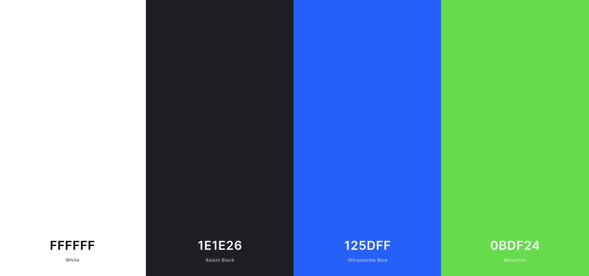
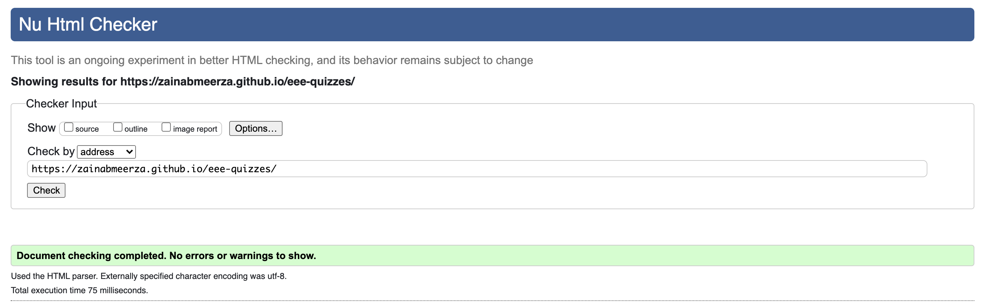
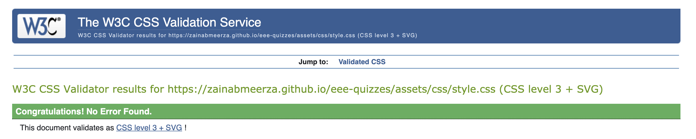
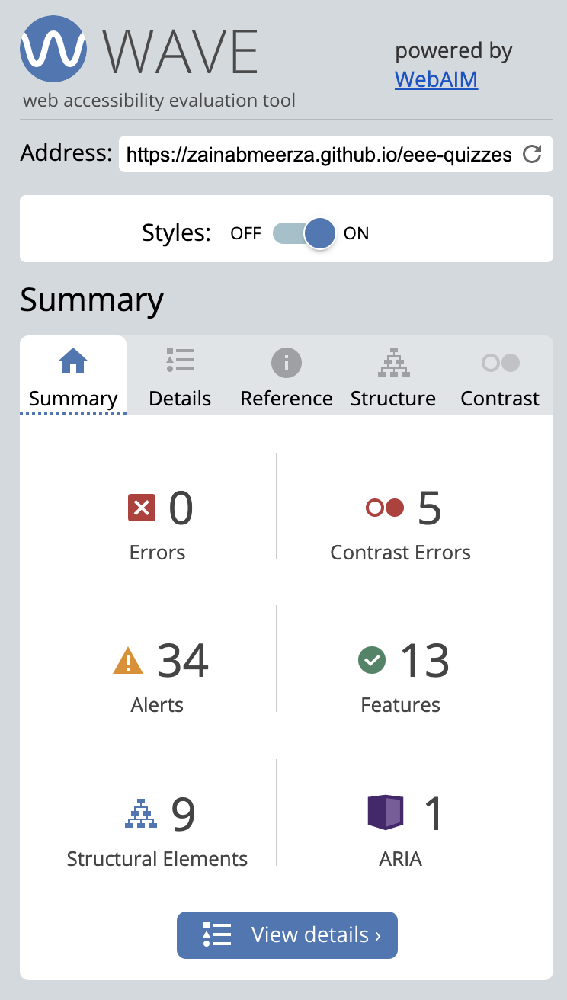

<h1><strong>EEE Quizzes</strong></h1>

<h2>Code Institute Milestone Project 2 -
Interactive Frontend Development</h2>

    The aim of the second project is to develop an interactive website using HTML, CSS and JS. The website is designed such that it follows industry standard UX conventions. This website is made for educational purposes only. 

<a href="https://zainabmeerza.github.io/eee-quizzes/" target="_blank" >View the live website in GitHub Pages</a>

This image is produced using the tool from <a href="http://ami.responsivedesign.is/#" target="_blank">Am I Responsive</a>

This website is created to provide students and teachers with educational resources that may help them for revision, class learning activities or even homework. It can be useful to any user who has an interest in learning about electronics and electrical circuits as a hobby. It provides them with a variety of quizzes, of different difficulties that cover a range of different topics. 
 

The website is divided into the following sections listed below:
    <ol>
        <li>The Main Menu - made up of a slider to provide the user with an overview of all the quizzes to select from and start.</li>
        <li>The Quiz Questions  - an interactive quiz made up of 10 questions, where 4 multiple choice answers is included for each question.</li>
        <li>The Final Score - Displays the final score the user obtained from the quiz and redirects them back to the Main Menu to select another quiz.</li>
    </ol>

<h3><strong>The business goals of this website are the following:</strong></h3>
    <ul>
        <li>
        To provide an educational learning platform for students. </li>
        <li>To provide teachers and schools leaarning resources for classroom activities</li>
        <li>To create a user friendly and easy to navigate website.</li>
    </ul>

<h3><strong>The customer goals of this website are the following:</strong></h3>
 <ul>
        <li>To have a reliable and interactive platform which is enaging the user whilst studying. </li>
        <li>To let the user briefly determine their level of knowledge on electrical circuits.</li>
        <li>To learn new information by acknowledging which questions were answered correctly or incorrectly. </li>
</ul>

<h1><strong>UX</strong></h1>

<h2><strong>Strategy</strong></h2>
The strategy approach for this site was to provide a variety of different quizzes that users would be able to intereact with to gain exposure to a wide range of topics within this subject area. Additionally ease of access and simplicity was important to allow users to navigate through clearly.
 
 
An essential part is to define who the target users of this website would be,and to consider what features they would like to see.

<strong>The ideal users of this website would be:</strong>
<ul>
<li>Students studying physics, electrical or electronics engineering. </li>
<li>Students interested in electronics and electrical circuits. </li>
<li>Teachers looking for engaging class activities and homework.</li>
<li>Students that would like to test and improve their knowledge on how electrical circuits operate. </li>
</ul>

<strong>This project will help these users by:</strong>
<ul>
<li>Providing a clear menu of quizzes that would be easy for them to navigate through.</li>
<li>Showing a selection of different quizzes that vary in difficulty and in topics. </li>
<li>Preview a diagram for each quiz relating to the topic.</li>
<li>Indicates whether they have answered the question correctly or incorrectly.</li>
<li>Provides them with a score on how well they have done on the quiz.</li>
</ul>

 

<strong>User stories:</strong>
<ol>
<li>As a first time visitor to the site, I would like to be able to navigate easily throughout the site and understand what it is for. </li>
<li>As a student, I would like a wide range of questions that cover a variety of difficulties and topics relating to the subject. </li>
<li>As a student, I would like to know if the question I have answered is correct or incorrect.</li>
<li>As a student, I would like to know how many questions I have left whilst taking the quiz. </li>
<li>As a student, I would want to be able to exit the selected quiz and choose another quiz instead, without having to complete the current quiz that I am on. </li>
<li>As a teacher, I would like some interactive and enaging material to use in class activities. </li>
<li>As a student, I would like to know the final score that I have achieved. </li>
<li>As a user, I would like to directly go back to the main menu once I complete a quiz. </li>
</ol>

<h2><strong>Scope</strong></h2>
To achieve the desired user & business goals, the following features have been included in this project release:
 
 
<ol>
<li> A landing page:</li>
    <ul>
        <li>A header containing the title of the page </li>
        <li>A Main Menu with an interactive slider to select a quiz.</li>
        <li>A diagram for each quiz that is related to the topic   of that specific quiz.</li>
        <li>Each quiz has a level of difficulty specified.</li>
        <li>A clear start button on each quiz.</li>
    </ul>
     
<li> A quiz page:</li>
    <ul>
    <li>A progress bar indicating the current question.</li>
    <li>A back to main menu button.</li>
    <li>10 questions and 4 multiple choice answers to choose from for each question </li>
    </ul>
     
<li> A final score page: </li>
    <ul>
        <li>The user's final score</li>
        <li>Back to main menu button</li>
    </ul>
 </ol>

<h2><strong>Structure</strong></h2>
This website is made up of 3 sections; the main menu, the quiz, and the final score. All these 3 sections were created on one single HTML page; and hence the website is made up of 1 page in total. Using CSS and JS, I was able to only display one section at a time and keep the other two hidden. The website landing page displays the main menu whilst keeping the quiz questions and final score reveal hidden. In the event that a quiz start button is clicked, the main menu is set to hidden, the quiz questions is set to display whilst the final score reveal remains hidden. Once the last question on the quiz has been answered, the quiz questions is set to hidden and the final score reveal is set to display.   
Therefore the flow of this website goes from main menu, to quiz, to final score and back to main menu. The website has 6 quizzes in total to choose from, where each quiz is made up of 10 questions and four possible answer buttons. The website is responsive across several devices.
 

<h2><strong>Skeleton</strong></h2>

The website consits of one single page, it consists of 3 sections that are not displayed all at once, but are displayed one at a time. 

<h3>The wireframe mockups for the landing page:</h3>
<a href="https://github.com/zainabmeerza/eee-quizzes/blob/main/assets/readmeimages/landing-page-mockup.png" target="_blank" >Landing Page - Desktop View</a> 
 
<a href="https://github.com/zainabmeerza/eee-quizzes/blob/main/assets/readmeimages/quiz-page-mockup.png" target="_blank" >Quiz Page - Desktop View</a> 
 
<a href="https://github.com/zainabmeerza/eee-quizzes/blob/main/assets/readmeimages/finalscore-mockup.png" target="_blank" >Final Score Page - Desktop View</a> 
 

<h2><strong>Surface</strong></h2>

The Google fonts 'Urbanist' and 'Roboto' were used consistently across the entire website. 'Roboto' was used for headings whilst 'Urbanist' was used for the body text. 

The color pallete used was generated by an online tool. The colour pallette generated and used is shown below.

To stand out when hovering over links/buttons the color changes from white to black. Additionally, the quiz answer button selected by the user from the 4 choices will change to red, if they answered incorrectly, or green if they answered correctly.
 
 

<h1><strong>Features</strong></h1>
<h2><strong>Main Menu</strong></h2>

 
 
<h2><strong>Quiz Cover Image</strong></h2>

 
 
<h2><strong>Quiz Difficulty Level</strong></h2>
 
 
 
<h2><strong>"Start" Buttons</strong></h2>

 
 
<h2><strong>"Back to Main Menu" Button </strong></h2>

  
  
<h2><strong>Question Indicator + Progress Bar </strong></h2>

 
 
<h1><strong>Features to Implement in the future:</strong></h1>
Due to limited time I was unable to include content in the lodging and dining pages as I planned to do so. Furthermore, due to my limited skills and scope of knowledge, there are several features and widgets I would hope to also implement in a future release of this project. These inlude:
<ul>
<li>Embedded weather widgets that would let the user know about the current weather conditions in Istanbul.</li>
<li>A lodging section filled with a list of hotels, hostels, resorts, B&B's that can be sorted according to their rating, availability, room type, number of guests, and price range. It will also include images and customer reviews. </li>
<li>A dining section filled with a list of restraunts, cafes, bakeries that can be sorted according to their rating and region. It will also include images and customer reviews. </li>
<li>An FAQ section with commonly asked questions to address some tips and advice to users planning on travelling to Istanbul.</li>
<li>A page advertising the latest and upcoming events in Istanbul such as concerts and festivals. This will include adverts from several business companies.</li>
<li>A page that includes a list of experiences, such as day trips, cruises, ferry rides, museum visits, etc. This will also inlcude ticket information, prices, booking information, and opening times. </li>
<li>A section with pre-planned itentaires that can be downloaded as a PDF file and printed out for users to follow.</li>
<li>The option to chose the language of the site. As this is a travel website, customers from a wide range of backgrounds, cultures and countries are expected to be browsing, and hence being able to tailor the language to their needs can help improve their accessibility.</li>
<li>The option to change currency options when viewing ticket prices or hotel prices.</li>
</ul>

<h1><strong>Technologies Used</strong></h1>
This project is based on HTML and CSS programming languages. Several technologies and tools were used to enable a functional design. These are listed below.
<ul>
<li>The three programming langauges;<strong> HTML5, CSS</strong> and <strong>JavaScript</strong>.</li>
<li><a href="https://www.gitpod.io/" target="_blank">GitPod</a> - Was the development environment used to write the code and build the project. </li>
<li><a href="https://github.com/" target="_blank">GitHub</a> - Was the platform used to hose the code that was written and pushed from GitPod. </li>
<li><a href="https://balsamiq.cloud" target="_blank">Balsamiq</a> - A rapid low-fidelity UI wireframing tool used to sketch a rough plan of the website structure and contents to abiding by rhe best UX practices. </li>
<li><a href="https://fontawesome.com/v6.0/icons?d=gallery&p=1&s=solid" target="_blank">FontAwesome</a> - The social media and title icons were taken from the toolkit provided by FontAwesome.</li>
<li><a href="https://fonts.google.com/specimen/Oswald#pairings" target="_blank">Google Fonts</a> - Used to style the website fonts. </li>
<li><a href="https://developer.chrome.com/docs/devtools/" target="_blank">Chrome Development Tools</a> - Used to test every stage whilst building the website, to help find and fix bugs within the code and test the responsiveness of the pages.</li>
<li><a href="https://www.flaticon.com/free-icons" target="_blank">Flat Icon</a> - Used to select a favicon for the website. </li>
<li><a href="https://coolors.co/" target="_blank">Coloors</a> - To select a desired colour scheme for the website.</li>
<li><a href="https://validator.w3.org/" target="_blank">W3C Markup Validation Service</a> - This tool was used to check the markup validity of the HTML Web documents of this project.</li>
<li><a href="https://jigsaw.w3.org/css-validator/" target="_blank">W3C CSS Validation Service</a> - This tool was used to check the validity of the CSS documents of this project. </li>
<li><a href="http://ami.responsivedesign.is/" target="_blank">Am I Responsive</a> - Was used to generate a repsonive image; displaying how the website would look on different devices. </li>
<li><a href="https://wave.webaim.org/" target="_blank">WAVE Web Accessibility Evaluation Tool</a> - Tool used to detect any accessibility issues within the website to help further improve it.</li>
<li><a href="http://sachinchoolur.github.io/lightslider//" target="_blank">JQuery lightslider</a> - A lightweight responsive content slider with carousel thumbnails navigation from the Jquery library.</li>
</ul>

<h1><strong>Testing</strong></h1>
<h2><strong>Testing user stories from UX of README.md</strong></h2>
<ol>
<li>As a first time visitor to the site, I would like to be able to navigate easily throughout the site and understand what it is for. </li>
     
    <ul>
    <li></li>
    <li></li>
    <li></li>
    </ul>
     

     
<li>As a student, I would like a wide range of questions that cover a variety of difficulties and topics relating to the subject.</li>
     
    <ul>
    <li>
    </li>
    </ul>
     

 
<li>As a student, I would like to know if the question I have answered is correct or incorrect.</li>
 
    <ul>
        <li> </li>
        <li></li>
    </ul>
     

 

 
<li>As a student, I would like to know how many questions I have left whilst taking the quiz. </li>
 
    <ul>
        <li></li>
        <li></li>
    </ul>
 

 

 

<li>As a student, I would want to be able to exit the selected quiz and choose another quiz instead, without having to complete the current quiz that I am on. </li>

 
<ul>
    <li></li>
</ul>
 

 

 
<li>As a teacher, I would like some interactive and enaging material to use in class activities. </li>
 
    <ul><li></li>
    </ul>
 

 
<li>As a student, I would like to know the final score that I have achieved. </li>
<li>As a user, I would like to directly go back to the main menu once I complete a quiz.</li>
</ol>
 
<h2><strong>HTML Validation</strong></h2>
I used <a href="https://validator.w3.org/" target="_blank">W3C Markup Validation</a> to check the validity of my HTML documents. Several issues were identified using this tool.
 
 
No errors were identified but four warnings were brought up and so the HTML was adjusted accordingly to eliminate these.
 
 

   
 
<h2><strong>CSS Validation</strong></h2>
I used <a href="https://jigsaw.w3.org/css-validator/" target="_blank">W3C CSS Validation</a> to check the validity of my CSS code. Several issues were identified using this tool.
 
 
Four errors were identified, and so the CSS was adjusted accordingly to improve on the errors. The <a href="https://github.com/zainabmeerza/eee-quizzes/blob/main/assets/css/style.css" target="_blank"> style.css</a> file was validated with no errors as this was the CSS file written by me. The other CSS file was borrowed as part of JQuery, hence has no errors but some warnings.
 
 

 
 
<h2><strong>Light House</strong></h2>
Lighthouse is a testing tool featured as part of Google Chrome developer tools. It is used to test the performance of the website. Initially the page achieved a very low score in performance and this was because of the high quality images used in the main menu that was not needed. To improve the performance, they were replaced with images of smaller sizes and this improved the performance score immensely. I also added some meta tags to improve the SEO performance. The final results I achieved are all above 90 for all scores.
 
 
<h3>Results of Light House testing on the single page created:</h3>
 

<h2><strong>WAVE Web Accessibility Evaluation</strong></h2>
I then used <a href="https://wave.webaim.org/" target="_blank">WAVE</a> which is a web accessibility evaluation tool. The results obtained from this test are shown below. This showed that the color contrast on the project was weak and coulb be improvement in tthe future. 
 
 

 
 
<h1><strong>Deployment</strong></h1>
This project was deployed via Gitpod. Using the git commands provided by Gitpod  the code was comitted to git, and then pushed onto GitHub.  It was then deployed onto the web using GitHub Pages.
 
<h2>Deploy on to GitHub Pages -</h2>
The following steps were carried out in order to deploy this project to GitHub Pages from its GitHub repository:
<ol>
<li>Log on to GitHub.</li>
<li>Select <strong>eee-quizzes</strong> from the list of repositories.</li>
<li>Within the repository, select <strong>settings</strong> from the menu located ta the top of the page.</li>
<li>Once directed to the settings, select <strong>Pages</strong> from the menu on the right-hand side of the settings.</li>
<li>Next, within the source section select the <strong>Master branch</strong> from the drop-down and then click save. </li>
<li>Wait for a few minutes whilst the website is being processed.</li>
<li>A few minutes later, the page URL will be given above the source section which links to the live site. This looks like the following:
 
 

</ol>

<h2>Run the website locally -</h2>
The forking tool can be used to make changes onto the repository without affecting it. This will make a copy of the repository so that the original one remains unchanged. This is done by:
<ol>
<li>Selecting the project repository and then clicking on the green <strong>'code'</strong> button. </li>
<li>Next, 'download ZIP' and extract this ZIP file onto your computer.</li>
<li>Once the foler is extracted, the index.html file in it can be opened on a browser. </li>
</ol>

<h2>Clone the website -</h2>
This will clone your working repository onto a local version. This is useful to backup work and can be done by:
<ol>
<li>Selecting the repository from GitHub.</li>
<li>Clicking on the green <strong>'code'</strong> button.</li>
<li>Copy the URL link provided by the drop-down.</li>
<li>Next open GitPod and change the current working directory into the directory location you are wanting to create the clone in.</li>
<li>Type <strong>'git clone'</strong> in the terminal, and past the URL link from step 3. </li>
<li>Finally press enter and a local clone will be created at the selected location</li>
</ol>

<h1><strong>Credits</strong></h1>
<h2><strong>Content</strong></h2>
The content for this website was obtained from several websites, which are listed below. 
<ul>
<li><a href="https://www.electroschematics.com/electronics-quizzes/" target="_blank">Electro Schematics</a> - Contributed to the quiz 1 questions.</li>
<li><a href="https://www.proprofs.com/quiz-school/topic/electronics" target="_blank">Pro Profs </a> - Contributed to the quiz 2 questions.</li>
<li><a href="http://www.freepubquiz.co.uk/electronics-quiz.html" target="_blank">Free Pub Quiz </a> - Contributed to the quiz 3 questions.</li>
<li><a href="https://www.funtrivia.com/playquiz/quiz518285f1b68.html" target="_blank">Fun Trivia </a> - Contributed to the quiz 4 quiz questions.</li>
<li><a href="https://quizizz.com/admin/quiz/5ad63362d5ecda00192e66b8/basic-electronics" target="_blank">Quizizz </a> - Contributed to the quiz 5 questions.</li>
<li><a href="https://quizlet.com/gb/topic/science/engineering/electrical-engineering/" target="_blank">Quizlet </a> - Contributed to the quiz 6 questions.</li>

</ul>

<h2><strong>Media</strong></h2>
<ul>
<li>All images used in the website were obtained from <a href="https://www.electronics-tutorials.ws" target="_blank">Electronic Tutorials.</a></li>

<li>The favicon used for the website was obtained from <a href="https://www.flaticon.com/free-icons" target="_blank">Flat Icon.</a></li>

<li>The bulb and arrow icons used accross the page were obtained from <a href="https://fontawesome.com/" target="_blank">Font Awesome.</a></li>
</ul>
<h2><strong>Code</strong></h2>
The following resources were used within the code and contributed to parts of the CSS, HTML and JS for this website.
<ol>

<li>The main menu slider (LightSlider) was created using <a href="http://sachinchoolur.github.io/lightslider/" target="_blank">JQuery.</a> Using this source, the code was borrowed which provided the entire contents for two of the JS files: <a href="https://github.com/zainabmeerza/eee-quizzes/blob/main/assets/js/JQuery3.3.1.js" target="_blank">JQuery3.3.1.js </a> and <a href="https://github.com/zainabmeerza/eee-quizzes/blob/main/assets/js/lightslider.js" target="_blank"> lightslider.js</a> and provided the entire content of one of the CSS files: <a href="https://github.com/zainabmeerza/eee-quizzes/blob/main/assets/css/lightslider.css" target="_blank">lightslider.css </a></li>

</ol>

<h1><strong>Acknowledgements</strong></h1>

I would like to extend my thanks to my course mentor Guido Cecilio for his feedback and guidance throughout the course of this project. His support and advice during our meetings helped me advance this project into the right direction. 